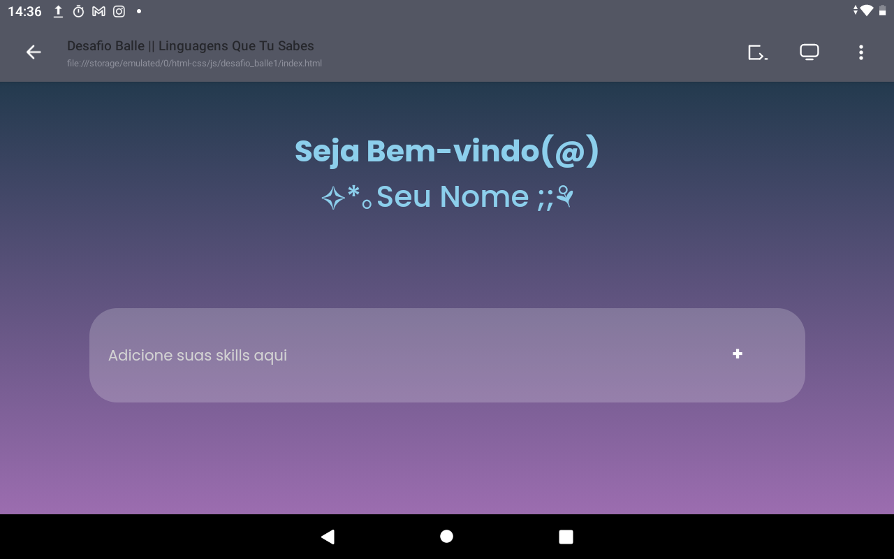

# desafio_balle1
Desafios propostos pela Tecnologia da Semanas, evento presente na comunidade do Discord da Rafaela Ballerini 
   

  
## Olá, tudo bem?
Se você está aqui para acompanhar sobre os desafios propostos na comunidade do Discord da Rafaela Ballerini: _welcome_! 🔥
  
Peço perdão se o site não estiver com uma boa visualização em telas de PCs, acontece que eu ainda não temho um para poder desenvolver bem, então eu não faço ideia de como fica a tela em resoluções maiores do que a do meu tablet — minha principal ferramenta de estudos. 🥲
  
Estou sempre aberto a sugestões de códigos e coisas que podem ser implementadas, claro que mensagems de hate sem fundamento eu simplesmente ignoro. 🌾
  
Espero que você goste desse exemplo, sinceramente eu nunca pensei que poderia evoluir tanto apenas praticando cada vez mais! 😍
